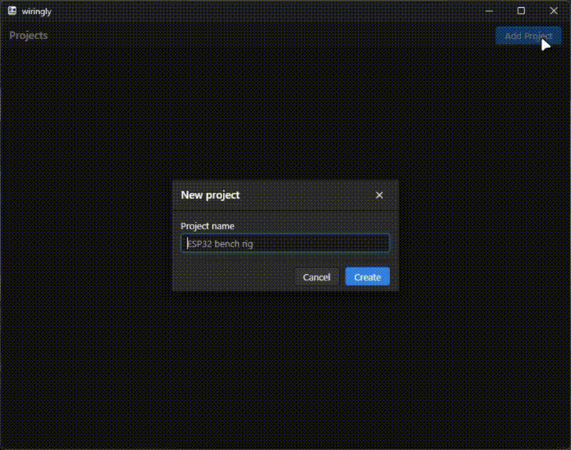

<div align="center">
  <h1>
    Wiringly
  </h1>
</div>

<div>
  

  <p style="padding-top: 8px">
    A desktop app for writing down how you wired two modules together, and exporting it as text.
  </p>

  <p>
    Add the modules you are working with to a project, say <code>ESP32</code> and <code>OLED LCD Display</code>,
    pair them up, then list the pins that connect. Export writes the project to a <code>.txt</code> file you can
    keep next to your firmware.
  </p>
</div>

<br clear="left">



## Features

- Projects, each holding its own modules, pairings and pins
- Pair any two modules in a project and add as many pin rows as the wiring needs
- Export to text, one section per pairing
- Data lives in one JSON file in the app data directory, so there is no account and no server
- Follows the desktop light or dark theme

## Export format

```
//// OLED LCD Display -> ESP32

OLED LCD Display.[GND] -> ESP32.[GND]
OLED LCD Display.[VCC] -> ESP32.[3V3]

---

//// SD Card module -> ESP32

SD Card module.[CS] -> ESP32.[GPIO 5]
```

## Development

You need Node 20.19 or newer, yarn, and the Rust toolchain with the
[Tauri prerequisites](https://tauri.app/start/prerequisites/) for your platform.

```sh
yarn install
yarn tauri dev      # run the app
yarn build          # type-check and build the frontend
yarn tauri build    # bundle an installer for the current platform
```

`yarn dev` on its own serves the frontend in a browser, where saving and the export dialog do not
work. Use `yarn tauri dev` to run the real thing.

## License

MIT, see [LICENSE](LICENSE).
